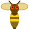
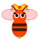
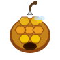

# Bear vs Bees

**v1.0.1-beta.1** - A browser-based survival arcade game developed for a game jam.


---

## Quick Facts

| Item | Details |
| --- | --- |
| Genre | Survival arcade |
| Platform | Web browser |
| Tech stack | HTML5, CSS3, Vanilla JavaScript |
| Core goal | Survive as long as possible and score as high as possible |

---

## Overview

Bear vs Bees is a fast survival game where the player must protect the bear from increasingly dangerous enemies, traps, and score-driven difficulty.

Play on itch.io: search for **Bear Versus Bees**.

---

## Gameplay

- Eliminate enemies to earn points
- Avoid traps and incoming damage
- Collect power-ups at the right moment
- Survive as long as possible while the challenge increases

### Main Systems

- Bees, wasps, and queen enemies
- Hive trap that damages the player
- Shield power-up
- Slow-motion power-up
- Combo-based scoring

---

## Difficulty and Progression

The game is score-driven, not level-driven in the HUD.

Difficulty increases automatically as the score rises:

- `350 points`: wasps start appearing
- `950 points`: the queen can spawn
- `1400 points`: storm ambiance and lightning effects are activated

This creates a clear and progressive difficulty curve.

---

## Win / Lose Conditions

- All hearts are lost
- The survival timer reaches zero

---

## Features

- Survival arcade gameplay
- Score and combo system
- Progressive difficulty based on score
- Enemy variety and trap mechanics
- Power-ups with tactical use
- Dynamic storm ambiance
- Background music and sound effects
- Modular front-end structure

---

## SVG Showcase

The project uses external SVG assets for the bear, enemies, and power-ups.

| Bear | Bee | Wasp | Queen | Hive | Honey Pot | Chrono |
| --- | --- | --- | --- | --- | --- | --- |
|  |  |  |  |  |  |  |

---

## Project Structure

```text
BEAR-VS-BEES/
|- index.html
|- README.md
|- css/
|  |- base.css
|  |- ui.css
|  `- screens.css
|- js/
|  |- state.js
|  |- audio.js
|  |- assets.js
|  |- environment.js
|  |- screens-template.js
|  |- ui.js
|  `- game.js
`- assets/
   |- audio/
   |  `- the_mountain-instrumental-513154.mp3
   `- svg/
      |- bear.svg
      |- bee.svg
      |- wasp.svg
      |- queen.svg
      |- hive.svg
      |- honey-pot.svg
      `- chrono.svg
```

---

## How to Run

1. Open the project folder in VS Code.
2. Use Live Server on `index.html`, or open the file directly in a browser.
3. No build step is required.

---

## Controls

- Mouse left-click: eliminate enemies and collect power-ups

---

## Status

The project is playable and organized into modular JavaScript, CSS, and asset files.
